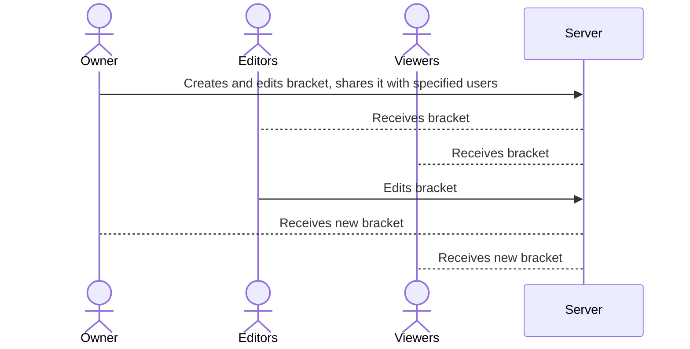

# Free Bracket Builder

[My Notes](notes.md)

The following application will be a versatile version of a bracket builder. The appeal is to make it free and easy to use as well as adaptable to user needs. Features will include custom themes, access to multiple tourney options (single and double elimination, seeded versus random matchups), and user permissions to specify who can view versus edit in real time. The application will allow the user to manage time with additional inputs: this will allow the user to account for the time it takes to play in a match and how many matches can be played at once. The final product will adapt to both browser and phone templates for viewing.   

## 🚀 Specification Deliverable

> [!NOTE]
>  Fill in this sections as the submission artifact for this deliverable. You can refer to this [example](https://github.com/webprogramming260/startup-example/blob/main/README.md) for inspiration.

For this deliverable I did the following. I checked the box `[x]` and added a description for things I completed.

- [x] Proper use of Markdown
- [x] A concise and compelling elevator pitch
- [x] Description of key features
- [x] Description of how you will use each technology
- [x] One or more rough sketches of your application. Images must be embedded in this file using Markdown image references.

### Elevator pitch

Free Bracket Builder will be an easy-to-use and quick version of a bracket builder, which will automatically slot participants in a tournament of the user's specifications. Unlike existing applications, this one will be free to use, contain custom themes, and grant unlimited access to typical specifications when creating a tourney (single and double elimination, seeded versus random matchups). The application will boast time management utilities for the user that other apps fail to include, which will account for both the time it takes to play a match as well as how many matches can be played at once. The final product will adapt to both browser and phone templates to be flexible for readers.   

### Design

```mermaid
sequenceDiagram
    actor Owner
    actor Editors
    actor Viewers
    Owner->>Server: Creates and edits bracket, shares it with specified users
    Server-->Editors: Receives bracket
    Server-->Viewers: Receives bracket
    Editors->>Server: Edits bracket
    Server-->Owner: Receives new bracket
    Server-->Viewers: Receives new bracket
```

### Key features

- Secure login over HTTPS
- Determine bracket framework, including title, type, team number, seeds, and other essential elements
- Optional choices for themes, time management components (optional depending on time and resources), and sharing options
- Easy editing for each match for time and location of match
- Sharing options expanded to include co-editors and viewers
- Bracket edits are persistently saved and stored in DB

### Technologies

I am going to use the required technologies in the following ways.

- **HTML** - Uses HTML structure for application. Four HTML pages: one for login, one for bracket creation, one for bracket structure, and the last containing all brackets the user is shared to.
- **CSS** - Styling for easy usage of bracket creation, choice colors and contrasts used for theme selection. 
- **React** - Login details, interaction with building, editing, and updating the bracket.  
- **Service** - Endpoints for login credentials, send sharing permissions, submitting and retrieving bracket formats and information, API call for theme palettes
- **DB/Login** - Store users, choices, and bracket info in database. Register and login users. Credentials securely stored in database. Can't edit brackets unless authenticated. 
- **WebSocket** - As brackets are created and shared, specified users are granted access. If brackets are made public, then no credentials are needed. 

## 🚀 AWS deliverable

For this deliverable I did the following. I checked the box `[x]` and added a description for things I completed.

- [x] **Server deployed and accessible with custom domain name** - [bracketbuilder.click](https://bracketbuilder.click).

## 🚀 HTML deliverable

For this deliverable I did the following. I checked the box `[x]` and added a description for things I completed.

- [x] **HTML pages** - Made about five including index page, bracket creation, listing of existing brackets, about page, etc.
- [x] **Proper HTML element usage** - Used head, body, nav, footer, etc. See GitHub for details
- [x] **Links** - Table of contents heading for each page
- [x] **Text** - About page has paragraphs and images
- [x] **3rd party API placeholder** - Create page will allow you to call third party color palletes in future
- [x] **Images** - See About page
- [x] **Login placeholder** - First page / index should have you log in
- [x] **DB data placeholder** - Bracket data stored for users
- [x] **WebSocket placeholder** - Bracket pages themselves will allow for live scoring and display

## 🚀 CSS deliverable

For this deliverable I did the following. I checked the box `[x]` and added a description for things I completed.

- [x] **Header, footer, and main content body** - Each tag has CSS styling to it, flexible scrolling, specific coloring and font styles, etc.
- [x] **Navigation elements** - Header now is tabs, styled to show which tab the user is on.
- [x] **Responsive to window resizing** - Footer disappears first when vertical resizing.
- [x] **Application elements** - Various elements and styles with buttons, lists, headings, etc. These had various selector styles in the many CSS files.
- [x] **Application text content** - Imported a cool font in About section quote.
- [x] **Application images** - I styled the volleyball image in the About section.

## 🚀 React part 1: Routing deliverable

For this deliverable I did the following. I checked the box `[x]` and added a description for things I completed.

- [x] **Bundled using Vite** - Ran `npm install vite`, installed bootstrap, etc. 
- [x] **Components** - Each page has its own .jsx and .css file under the src folder structure. Created app.jsx and app.css files
- [x] **Router** - app.jsx and main.jsx have routers installed

## 🚀 React part 2: Reactivity deliverable

For this deliverable I did the following. I checked the box `[x]` and added a description for things I completed.

- [x] **All functionality implemented or mocked out** - Building a bracket or round robin, logging in, editing the bracket live, declaring a winner, holding multiple brackets within a user. All of these are completed.
- [x] **Hooks** - `useState` and `useEffects` hooks found on most pages 

## 🚀 Service deliverable

For this deliverable I did the following. I checked the box `[x]` and added a description for things I completed.

- [x] **Node.js/Express HTTP service** - Initialized, called for express in index.js. Created service folder.
- [x] **Static middleware for frontend** - Created using  `app.use(express.static('public'));`. Frontend files are copied into the public directory. 
- [x] **Calls to third party endpoints** - API call for quote in About section. This is implemented using `fetch()` inside about.jsx
- [x] **Backend service endpoints** - service/index.js handles POST and GET requests for user actions, such as sign up, login, and logout. 
- [x] **Frontend calls service endpoints** - 
- [x] **Supports registration, login, logout, and restricted endpoint** - Functionality added to create and save users, uses hash codes for keeping passwords safe, users now must log in to access the app.
- [x] **Uses BCrypt to hash passwords** - Passwords are hashed using the bcryptjs library before being stored in the user database (users.json). This ensures that plaintext passwords are never saved and improves overall authentication security.

## 🚀 DB deliverable

For this deliverable I did the following. I checked the box `[x]` and added a description for things I completed.

- [ ] **Stores data in MongoDB** - I did not complete this part of the deliverable.
- [ ] **Stores credentials in MongoDB** - I did not complete this part of the deliverable.

## 🚀 WebSocket deliverable

For this deliverable I did the following. I checked the box `[x]` and added a description for things I completed.

- [ ] **Backend listens for WebSocket connection** - I did not complete this part of the deliverable.
- [ ] **Frontend makes WebSocket connection** - I did not complete this part of the deliverable.
- [ ] **Data sent over WebSocket connection** - I did not complete this part of the deliverable.
- [ ] **WebSocket data displayed** - I did not complete this part of the deliverable.
- [ ] **Application is fully functional** - I did not complete this part of the deliverable.
